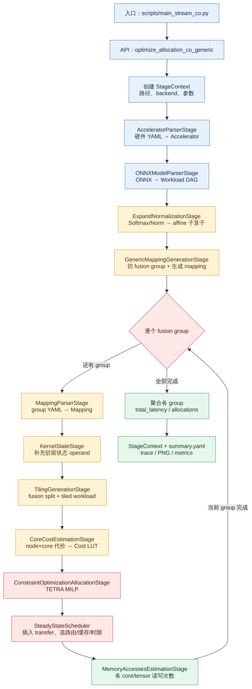

# Stream Workflow

本文说明 Stream 通用 Constraint Optimization（CO）路径的实际执行流程：从硬件 YAML 和 ONNX workload 输入，到 fusion-group 划分、代价建模、TETRA MILP 求解及结果输出。



可编辑版本见 [`stream-flow.drawio`](stream-flow.drawio)。

## 入口与运行方式

通用命令入口为 `scripts/main_stream_co.py`：

```bash
python scripts/main_stream_co.py \
  --hardware stream/inputs/examples/hardware/tpu_like_quad_core.yaml \
  --workload stream/inputs/testing/workload/2conv_1_8_32_32_16_32_3.onnx
```

不传 `--mapping` 时，入口调用 `optimize_allocation_co_generic()` 自动生成 mapping；传入 mapping YAML 时，则调用 `optimize_allocation_co_with_mapping()`。默认 solver backend 是无需商业许可证的 `ortools_gscip`。

## Pipeline 执行模型

Stage 列表由 `stream/api.py::_build_generic_co_stages()` 定义：

```text
AcceleratorParserStage
→ ONNXModelParserStage
→ ExpandNormalizationStage
→ GenericMappingGenerationStage
→ FusionGroupIterationStage
    → MappingParserStage
    → KernelStateStage
    → TilingGenerationStage
    → CoreCostEstimationStage
    → ConstraintOptimizationAllocationStage
    → MemoryAccessesEstimationStage
```

`MainStage` 并不是依次调用一组独立函数。它实例化第一个 Stage，并把剩余 Stage 作为下游列表传入。每个 Stage 读取和更新同一个 `StageContext`，再构造下一级 Stage。`StageContext` 因而是整个 pipeline 的数据总线，保存输入参数以及 `workload`、`accelerator`、`mapping`、`cost_lut`、`scheduler` 等中间或最终结果。

## 输入解析与规范化

1. **硬件解析**：`AcceleratorParserStage` 验证硬件 YAML，构造包含计算核、存储核、存储层次和互连的 `Accelerator`。
2. **Workload 解析**：`ONNXModelParserStage` 将 ONNX 转换为内部 `Workload` DAG，并尽可能输出 workload 可视化。
3. **算子展开**：`ExpandNormalizationStage` 将 Softmax/Normalization 展开为 max、exp、sum、div 等 affine 子算子，使 reduction、计算和访存能够被显式建模。

## Fusion Group 外层循环

`GenericMappingGenerationStage` 根据调用者提供的 cut points，或 workload 中推导出的 affine barriers，切分 fusion groups；随后为每组生成子 workload 和 mapping。

`FusionGroupIterationStage` 对每个 group 独立运行内部 pipeline：

```text
group mapping → tiling → core cost LUT → TETRA MILP → memory statistics
```

每组生成独立的 `group_<n>/` 输出目录。顶层总延迟为：

$$
L_{\mathrm{total}} = \sum_g L_g.
$$

因此当前实现是“分组后独立求解并聚合”，而不是把所有 fusion groups 放进同一个全局 MILP。最终 `ctx["scheduler"]` 和 `ctx["workload"]` 对应最后一个 group；读取完整多组结果时，应使用 `group_latencies`、`group_allocations` 和 `group_memory_accesses`。

## Group 内部优化

### Mapping、状态与 Tiling

`MappingParserStage` 把 group mapping 转成内部 `Mapping`。`KernelStateStage` 为带递归状态的 kernel 添加驻留 state operand。`TilingGenerationStage` 决定 fusion splits，将完整循环空间转换成用于稳态分析的 tiled workload，同时保留未切分 group 的总 MAC 数用于端到端利用率统计。

### Core Cost LUT

`CoreCostEstimationStage` 为每个合法 `(node, core)` 组合计算并缓存局部代价。不同 core 由相应 backend 估算，例如 ZigZag 或原生 AIE estimator。该阶段回答“某节点在某 core 上执行需要多少代价”，但尚未决定全局 tensor placement、通信路径或时间安排。

### TETRA MILP 与稳态调度

`ConstraintOptimizationAllocationStage` 创建 `SteadyStateScheduler`。Scheduler 首先插入显式 transfer nodes，然后建立 steady-state iteration spaces、执行次数和资源感知 timeslots，最后调用 `TransferAndTensorAllocator`。

MILP 联合选择：

- tensor reuse level 和 buffer depth；
- 计算、tensor、transfer 与 memory allocation；
- 通信路由和 memory-tile staging；
- DMA、buffer descriptor、容量等资源约束；
- timeslot latency、迭代重叠和总 latency。

只有 solver 返回 `OPTIMAL` 时结果才被接受；否则代码生成结构化 infeasibility report 并抛出 `InfeasibleAllocationError`。

## 结果与证据边界

典型输出结构如下：

```text
outputs/<experiment-id>/
├── summary.yaml
├── workload_graph.svg
└── group_0/
    ├── core_cost_lut.pickle
    ├── core_cost_lut.yaml
    ├── tiled_workload.png
    ├── steady_state_workload_final.png
    └── tetra/
        ├── optimization_metrics.yaml
        ├── slot_latency_breakdown.yaml
        └── steady_state_trace*.json
```

`summary.yaml` 给出总 latency、各 group latency 及 wall time；Perfetto trace 展示求解后的计算和通信时间线；memory-access 统计描述各 core/tensor 的读写次数。需要注意，`MemoryAccessesEstimationStage` 位于 MILP 之后，属于结果观测，不是当前优化目标本身。当前代码只把该统计写入 `StageContext`，再由外层保存进 `group_memory_accesses`；虽然 Stage 内定义了 `memory_accesses.yaml` 路径，但尚未执行 YAML 写盘。

`optimize_mapping()` 还会在上述 pipeline 外增加一层 DSE：枚举多个 mapping variant，分别执行 CO，并返回最低 latency 的候选。AIE 脚本则可在 allocation 前后插入 `AIECodeGenerationStage`，生成面向 AMD Strix NPU 的 MLIR；它不是通用 CO 路径的必需步骤。
